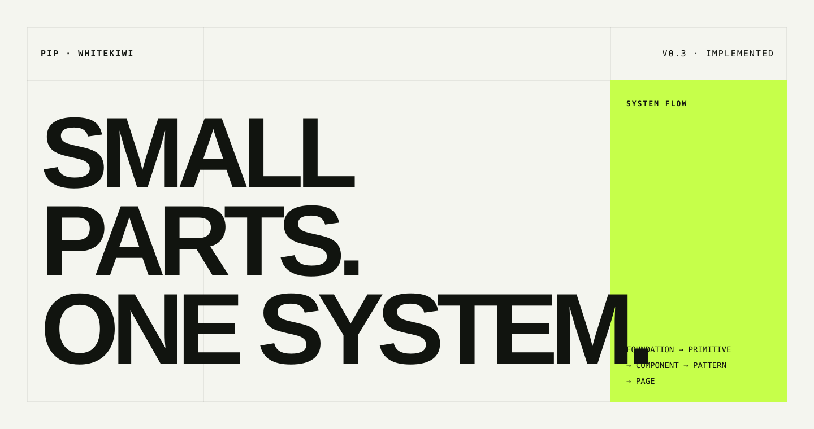

<p align="center">
  
</p>

<p align="center">
  <strong>Quiet canvas. Electric kiwi. Human evidence.</strong><br>
  WhiteKiwi가 더 빠르게 같은 결정을 내리기 위한 공개 설계 언어.
</p>

<p align="center">
  <a href="https://design.whitekiwi.link/">Documentation</a> ·
  <a href="docs/guidelines.md">Guidelines</a> ·
  <a href="DESIGN.md">Agent contract</a> ·
  <a href="references/README.md">Reference base</a>
</p>

---

## What PIP decides

PIP은 component gallery보다 **decision system**에 가깝습니다. 색과 간격의 값뿐 아니라 언제 강조하고, 무엇을 움직이며, 외부 component를 어떤 기준으로 채택하는지까지 코드와 문서로 함께 관리합니다.

| Layer | Owns | Does not own |
| --- | --- | --- |
| **Foundation** | color roles, type, space, radius, motion | product-specific composition |
| **Primitive** | focus, keyboard, disclosure behavior | visual identity |
| **Component** | semantics, state, reusable API | one-off page stories |
| **Pattern** | repeated product decisions | speculative abstraction |
| **Page** | evidence, task, audience context | raw visual values |

```text
Foundation → Primitive → Component → Pattern → Page
    roles      behavior       contract      decision    context
```

## Packages

| Package | Purpose | Current surface |
| --- | --- | --- |
| `@whitekiwi/tokens` | Light·dark semantic tokens and state contracts | color, spacing, typography, radius, motion, breakpoints |
| `@whitekiwi/ui` | Owned React source with explicit behavior | controls, feedback, editorial surfaces, Disclosure |
| `@whitekiwi/docs` | Public guideline and visual QA surface | foundations, states, patterns, inventory, governance |

The source of truth lives in [`packages/tokens/src/theme.css`](packages/tokens/src/theme.css), [`packages/ui/src`](packages/ui/src), and [`docs/guidelines.md`](docs/guidelines.md). The public site demonstrates implemented contracts; it does not silently promote candidates to reality.

## Core contracts

1. Choose one protagonist per viewport: a large kiwi field, kiwi headline, or kiwi metric—not all three.
2. Keep ordinary screens near 90% neutral area so the signal stays meaningful.
3. Static surfaces never borrow pointer, lift, arrow, or inversion from navigation.
4. Interactive families define rest, hover, active, focus-visible, and disabled in both themes.
5. Components consume semantic roles, not primitive hex values or local color mixes.
6. Normal text meets 4.5:1; large text, essential boundaries, and focus indicators meet 3:1.
7. Mobile recomposes the same information priority instead of shrinking the desktop grid.

For the compact implementation contract used by coding agents, read [`DESIGN.md`](DESIGN.md).

## Component inventory

| Family | Exports | Contract |
| --- | --- | --- |
| Controls | `Button`, `TextField`, `TextLink` | visible interaction and validation states |
| Feedback | `Badge`, `Callout` | neutral, brand, and status tones with labels |
| Editorial | `StaticCard`, `LinkedCard`, `SectionHeading`, `CollectionHeading` | content and navigation affordance remain distinct |
| Disclosure | `Disclosure` | Radix-backed keyboard and focus behavior |

## Adoption policy

Native semantic HTML is the first choice. A behavior primitive is justified when focus management, keyboard navigation, layering, or disclosure is genuinely difficult. Registry components are references, not design authority.

```text
reference → candidate → approved → implemented
```

Before adoption, verify canonical source, license, dependencies, semantic markup, keyboard behavior, focus visibility, reduced motion, responsive composition, and compatibility with PIP tokens. The rationale and primary sources are recorded in [`references/README.md`](references/README.md).

## Develop

Requirements: Node.js 24+ and pnpm 10.33.0.

```bash
pnpm install
pnpm dev
pnpm check
```

`pnpm check` runs formatting/lint checks, TypeScript validation, the UI package build, and the production documentation build.

## Repository map

```text
apps/docs/       public documentation and visual QA surface
packages/tokens/ semantic foundations for both themes
packages/ui/     owned React components and styles
docs/            canonical human-readable guideline
references/      authoritative source map and rationale
deploy/          static release activation
DESIGN.md        compact implementation contract for agents
```

## Consumer boundary

The first consumer is [WhiteKiwi Portfolio](https://portfolio.whitekiwi.link/). Product-specific story layout stays with the consumer until a second real use proves a reusable pattern. Token or core component changes should ship with documentation and representative visual QA in the same review unit.

---

<p align="center">
  <sub>PIP v0.3 · Implemented · WhiteKiwi</sub>
</p>
